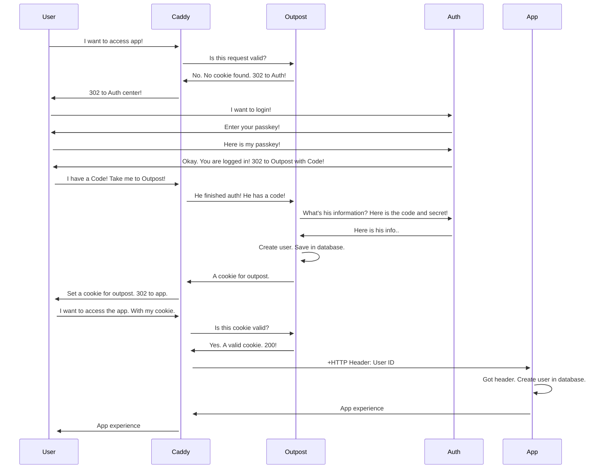

# Aiursoft 所有基础设施使用 Authentik 来进行统一身份验证

## OpenWeb Chat

未登录完全无法使用，已登录可以使用几乎所有功能，管理员可以管理高级设置。

* 基于 OpenId Connect 协议。
* Client ID 和 Client Secret 需要通过环境变量传递给 OpenWeb Chat 服务。
* 基于环境变量继承权限信息。可以将具有特定 `group` 的用户添加到 OpenWeb Chat 的管理员组中。
  * 基于环境变量 `ENABLE_OAUTH_ROLE_MANAGEMENT` 来确保开启了角色管理功能。
  * 基于环境变量 `OAUTH_ADMIN_ROLES` 来指定哪些 `group` 的用户可以成为 OpenWeb Chat 的管理员。
  * 基于环境变量 `OAUTH_ROLES_CLAIM` 来指定 `groups` 这个字段代表用户的角色信息。
* 在合并用户时自动根据 Email 进行匹配。
* 注销时只会注销 OpenWeb Chat 的会话，不会影响 Authentik 的会话。

注意：需要额外配置环境变量 `ENABLE_OAUTH_SIGNUP=True` 来允许 OAuth 完成的用户自动注册 OpenWeb Chat。

注意：需要额外配置环境变量 `ENABLE_SIGNUP=False` 来让 OpenWeb Chat 禁用注册功能。

## Jellyfin

未登录完全无法使用，已登录可以使用几乎所有功能，管理员可以管理高级设置。

* 基于 OpenId Connect 协议。
* Client ID 和 Client Secret 需要通过应用内的插件配置传给 Jellyfin 服务。
* 基于插件的配置继承权限信息。可以将具有特定 `group` 的用户添加到 Jellyfin 的管理员组中。
  * 基于插件配置 `Enable Authorization by Plugin` 来确保开启了角色管理功能。
  * 基于插件配置 `Admin Roles:jellyfin-admins` 来指定哪些 `group` 的用户可以成为 Jellyfin 的管理员。
  * 基于插件配置 `Role Claim:groups` 来指定 `groups` 这个字段代表用户的角色信息。
* 在合并用户时自动根据用户名进行匹配。
* 注销时只会注销 Jellyfin 的会话，不会影响 Authentik 的会话。

注意，需要额外配置插件配置 `Scheme Override:https` 来让 OAuth 正常工作。

注意，需要额外修改 CSS 设置和 HTML 设置来让登录页面隐藏正常的登录框，并显示 Authentik 的登录框。

## OpenGist

未登录可以匿名浏览，已登录可以使用几乎所有功能，管理员可以管理高级设置。

* 基于 OpenId Connect 协议。
* Client ID 和 Client Secret 需要通过环境变量传递给 OpenGist 服务。
* 基于环境变量继承权限信息。可以将具有特定 `group` 的用户添加到 OpenGist 的管理员组中。
  * 默认就开启了角色管理功能。
  * 基于环境变量 `OG_OIDC_ADMIN_GROUP` 来指定哪些 `group` 的用户可以成为 OpenGist 的管理员。
  * 基于环境变量 `OG_OIDC_GROUP_CLAIM_NAME` 来指定 `groups` 这个字段代表用户的角色信息。
* 无法合并。需要手工删除老用户。
* 注销时只会注销 OpenGist 的会话，不会影响 Authentik 的会话。

注意，需要额外在管理员中心配置 `Disable signup` 为关，来确保 OAuth 完成的用户可以自动注册 OpenGist。

注意：需要额外在管理员中心配置 `Disable login form` 为开，来确保不再显示 OpenGist 的登录框。

## Gitea

未登录可以匿名浏览，已登录可以使用几乎所有功能，管理员可以管理高级设置。

* 基于 OpenId Connect 协议。
* Client ID 和 Client Secret 需要通过应用内置的 OAuth2 配置传给 Gitea 服务。
* 基于应用内置的 OAuth2 配置继承权限信息。可以将具有特定 `group` 的用户添加到 Gitea 的管理员组中。
  * 基于应用内置的 OAuth2 配置 `Claim name providing group names for this source. (Optional)` 来确保开启了角色管理功能。
  * 基于应用内置的 OAuth2 配置 `Group Claim value for administrator users. (Optional - requires claim name above)` 来指定哪些 `group` 的用户可以成为 Gitea 的管理员。
  * 基于应用内置的 OAuth2 配置 `Claim name providing group names for this source. (Optional)` 来指定 `groups` 这个字段代表用户的角色信息。
* 在合并用户时自动根据 Email 进行匹配。
* 注销时只会注销 Gitea 的会话，不会影响 Authentik 的会话。

注意，需要额外配置应用的环境变量

```env
[service]
REGISTER_EMAIL_CONFIRM = false
ENABLE_NOTIFY_MAIL = false
DISABLE_REGISTRATION = true
ALLOW_ONLY_EXTERNAL_REGISTRATION = true
REQUIRE_SIGNIN_VIEW = false
ENABLE_PASSWORD_SIGNIN_FORM = false
ENABLE_PASSKEY_AUTHENTICATION = false

[openid]
ENABLE_OPENID_SIGNIN = false
ENABLE_OPENID_SIGNUP = false

[oauth2_client]
ENABLE_AUTO_REGISTRATION = true
ACCOUNT_LINKING = auto

```

来实现匿名可以浏览、注册无需确认、注册无需邮件通知、禁止注册、禁止密码登录、禁止外部 OpenID 登录、禁止外部 OAuth 登录、自动注册 OAuth 完成的用户、自动合并 OAuth 完成的用户。

## Koel



未登录完全无法使用，已登录可以使用几乎所有功能。

* 基于 Forward Auth 协议。
* 通过 Caddy 的 Forward Auth 模块来验证用户身份。
* Koel 会基于 IP 地址来确保只有来自 Caddy 的请求才会被接受。
* Koel 自己会通过 HTTP Header 来获取用户信息。
* 不支持权限管理。所有人都是 User 角色。
* 不支持合并用户。需要手工删除老用户。
* 注销时只会注销 Koel 的会话，不会影响 Authentik 的会话。

## Gitlab

未登录可以匿名浏览，已登录可以使用几乎所有功能，管理员可以管理高级设置。

* 基于 OpenId Connect 协议。
* Client ID 和 Client Secret 需要通过应用内置的 OAuth2 配置传给 Gitlab 服务。