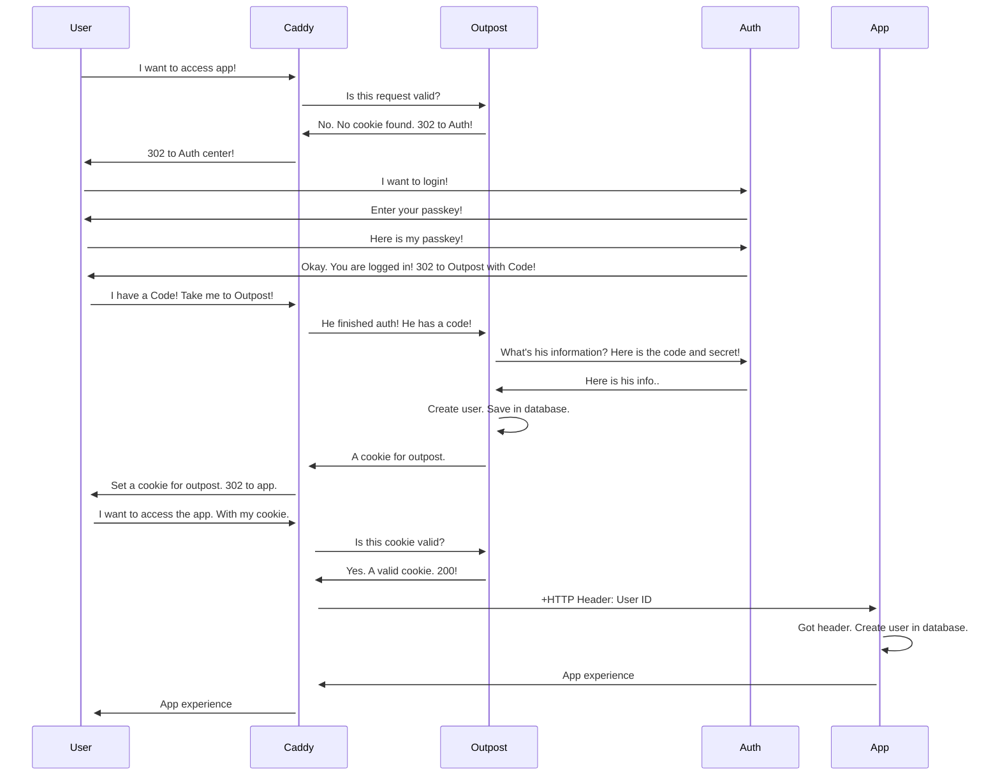

# Aiursoft 所有基础设施使用 Authentik 来进行统一身份验证

## 口诀

未登录、已登录、管理员

* 协议名称
* 传参方式
* 权限继承方式
  * 开启角色管理
  * 管理员组开启
  * 角色信息字段
  * 禁止登录框
* 合并用户方式
* 注销行为

## OpenWeb Chat

未登录完全无法使用，已登录可以使用几乎所有功能，管理员可以管理高级设置。

* 基于 OpenId Connect 协议。
* Client ID 和 Client Secret 需要通过环境变量传递给 OpenWeb Chat 服务。
* 基于环境变量继承权限信息。可以将具有特定 `group` 的用户添加到 OpenWeb Chat 的管理员组中。
  * 基于环境变量 `ENABLE_OAUTH_ROLE_MANAGEMENT` 来确保开启了角色管理功能。
  * 基于环境变量 `OAUTH_ADMIN_ROLES` 来指定哪些 `group` 的用户可以成为 OpenWeb Chat 的管理员。
  * 基于环境变量 `OAUTH_ROLES_CLAIM` 来指定 `groups` 这个字段代表用户的角色信息。
  * 基于环境变量 `ENABLE_LOGIN_FORM=False` 来禁止 OpenWeb Chat 的登录框。
* 在合并用户时自动根据 Email 进行匹配。
* 注销时只会注销 OpenWeb Chat 的会话，不会影响 Authentik 的会话。

注意：需要额外配置环境变量 `ENABLE_OAUTH_SIGNUP=True` 来允许 OAuth 完成的用户自动注册 OpenWeb Chat。

注意：需要额外配置环境变量 `ENABLE_SIGNUP=False` 来让 OpenWeb Chat 禁用注册功能。

## Jellyfin

未登录完全无法使用，已登录可以使用几乎所有功能，管理员可以管理高级设置。

* 基于 OpenId Connect 协议。
* Client ID 和 Client Secret 需要通过应用内的插件配置传给 Jellyfin 服务。
* 基于插件的配置继承权限信息。可以将具有特定 `group` 的用户添加到 Jellyfin 的管理员组中。
  * 基于插件配置 `Enable Authorization by Plugin` 来确保开启了角色管理功能。
  * 基于插件配置 `Admin Roles:jellyfin-admins` 来指定哪些 `group` 的用户可以成为 Jellyfin 的管理员。
  * 基于插件配置 `Role Claim:groups` 来指定 `groups` 这个字段代表用户的角色信息。
  * 基于 Generic 配置 `.manualLoginForm { display: none; }` 来禁止 Jellyfin 的登录框。
* 在合并用户时自动根据用户名进行匹配。
* 注销时只会注销 Jellyfin 的会话，不会影响 Authentik 的会话。

注意，需要额外配置插件配置 `Scheme Override:https` 来让 OAuth 正常工作。

## OpenGist

未登录可以匿名浏览，已登录可以使用几乎所有功能，管理员可以管理高级设置。

* 基于 OpenId Connect 协议。
* Client ID 和 Client Secret 需要通过环境变量传递给 OpenGist 服务。
* 基于环境变量继承权限信息。可以将具有特定 `group` 的用户添加到 OpenGist 的管理员组中。
  * 默认就开启了角色管理功能。
  * 基于环境变量 `OG_OIDC_ADMIN_GROUP` 来指定哪些 `group` 的用户可以成为 OpenGist 的管理员。
  * 基于环境变量 `OG_OIDC_GROUP_CLAIM_NAME` 来指定 `groups` 这个字段代表用户的角色信息。
  * 基于应用内置的 OAuth2 配置 `Disable login form` 来禁止 OpenGist 的登录框。
* 无法合并。需要手工删除老用户。
* 注销时只会注销 OpenGist 的会话，不会影响 Authentik 的会话。

注意，需要额外在管理员中心配置 `Disable signup` 为关，来确保 OAuth 完成的用户可以自动注册 OpenGist。

## Gitea

未登录可以匿名浏览，已登录可以使用几乎所有功能，管理员可以管理高级设置。

* 基于 OpenId Connect 协议。
* Client ID 和 Client Secret 需要通过应用内置的 OAuth2 配置传给 Gitea 服务。
* 基于应用内置的 OAuth2 配置继承权限信息。可以将具有特定 `group` 的用户添加到 Gitea 的管理员组中。
  * 基于应用内置的 OAuth2 配置 `Claim name providing group names for this source. (Optional)` 来确保开启了角色管理功能。
  * 基于应用内置的 OAuth2 配置 `Group Claim value for administrator users. (Optional - requires claim name above)` 来指定哪些 `group` 的用户可以成为 Gitea 的管理员。
  * 基于应用内置的 OAuth2 配置 `Claim name providing group names for this source. (Optional)` 来指定 `groups` 这个字段代表用户的角色信息。
  * 基于环境变量 `ENABLE_PASSWORD_SIGNIN_FORM = false` 和 `ENABLE_OPENID_SIGNIN = false` 来禁止 Gitea 的登录框。
* 在合并用户时自动根据 Email 进行匹配。
* 注销时只会注销 Gitea 的会话，不会影响 Authentik 的会话。

注意，需要额外配置应用的环境变量:

```env
[service]
REGISTER_EMAIL_CONFIRM = false
ENABLE_NOTIFY_MAIL = false
DISABLE_REGISTRATION = true
ALLOW_ONLY_EXTERNAL_REGISTRATION = true
ENABLE_CAPTCHA = true
CAPTCHA_TYPE = image
REQUIRE_SIGNIN_VIEW = false
DEFAULT_KEEP_EMAIL_PRIVATE = false
DEFAULT_ALLOW_CREATE_ORGANIZATION = true
DEFAULT_ENABLE_TIMETRACKING = true
NO_REPLY_ADDRESS = noreply.localhost
ENABLE_PASSWORD_SIGNIN_FORM = false
ENABLE_PASSKEY_AUTHENTICATION = false

[lfs]
PATH = /data/git/lfs

[mailer]
ENABLED = false

[openid]
ENABLE_OPENID_SIGNIN = false
ENABLE_OPENID_SIGNUP = false

[oauth2_client]
ENABLE_AUTO_REGISTRATION = true
ENABLE_AUTO_REGISTRATION = true
ACCOUNT_LINKING = auto
```

来实现匿名可以浏览、注册无需确认、注册无需邮件通知、禁止注册、禁止密码登录、禁止外部 OpenID 登录、禁止外部 OAuth 登录、自动注册 OAuth 完成的用户、自动合并 OAuth 完成的用户。

## Koel



未登录完全无法使用，已登录可以使用几乎所有功能。

* 基于 Forward Auth 协议。
* 通过 Caddy 的 Forward Auth 模块来验证用户身份。
* Koel 会基于 IP 地址来确保只有来自 Caddy 的请求才会被接受。
* Koel 自己会通过 HTTP Header 来获取用户信息。
* 不支持权限管理。所有人都是 User 角色。
* 不支持合并用户。需要手工删除老用户。
* 注销时只会注销 Koel 的会话，不会影响 Authentik 的会话。

注意，需要额外配置应用的环境变量:

```env
PROXY_AUTH_ENABLED=true
PROXY_AUTH_ALLOW_LIST=0.0.0.0/0,::/0 # Actual IP of Caddy
PROXY_AUTH_USER_HEADER=X-Authentik-Uid
PROXY_AUTH_PREFERRED_NAME_HEADER=X-Authentik-Username
```

## GitLab

未登录可以匿名浏览，已登录可以使用几乎所有功能，管理员可以管理高级设置。

* 基于 OpenId Connect 协议。
* Client ID 和 Client Secret 需要通过应用内置的配置文件传给 Gitlab 服务。
* 基于应用内置的配置文件继承权限信息。可以将具有特定 `group` 的用户添加到 Gitlab 的管理员组中。
  * 默认就开启了角色管理功能。
  * 基于应用内置的配置文件 `gitlab_rails['omniauth_providers']` 来指定哪些 `group` 的用户可以成为 Gitlab 的管理员。
  * 基于应用内置的配置文件 `gitlab_rails['omniauth_providers']` 来指定 `groups` 这个字段代表用户的角色信息。
  * 基于应用内置的配置文件 `gitlab_rails['omniauth_allow_single_sign_on']` 来禁止 Gitlab 的登录框。
* 在合并用户时自动根据 Email 进行匹配。
* 注销时只会注销 Gitlab 的会话，不会影响 Authentik 的会话。

注意，需要额外配置应用的环境变量:

```ini
gitlab_rails['omniauth_allow_single_sign_on'] = ['openid_connect']
gitlab_rails['omniauth_sync_email_from_provider'] = 'openid_connect'
gitlab_rails['omniauth_sync_profile_from_provider'] = ['openid_connect']
gitlab_rails['omniauth_sync_profile_attributes'] = ['email']
gitlab_rails['omniauth_auto_sign_in_with_provider'] = 'openid_connect'
gitlab_rails['omniauth_block_auto_created_users'] = false
# gitlab_rails['omniauth_auto_link_ldap_user'] = false
# gitlab_rails['omniauth_auto_link_saml_user'] = false
gitlab_rails['omniauth_auto_link_user'] = ['openid_connect']
# gitlab_rails['omniauth_external_providers'] = ['twitter', 'google_oauth2']
gitlab_rails['omniauth_allow_bypass_two_factor'] = ['openid_connect']
gitlab_rails['omniauth_providers'] = [
  {
    name: 'openid_connect',
    label: 'Aiursoft Login',
    args: {
      name: 'openid_connect',
      scope: ['openid','profile','email'],
      response_type: 'code',
      issuer: 'https://auth.aiursoft.cn/application/o/gitlab/',
      discovery: true,
      client_auth_method: 'query',
      uid_field: 'preferred_username',
      send_scope_to_token_endpoint: 'true',
      pkce: true,
      client_options: {
        identifier: '<id>',
        secret: '<secret>',
        redirect_uri: 'https://gitlab.aiursoft.cn/users/auth/openid_connect/callback',
        gitlab: {
          groups_attribute: "groups",
          admin_groups: ["gitlab-admins"]
        }
      }
    }
  }
]
```